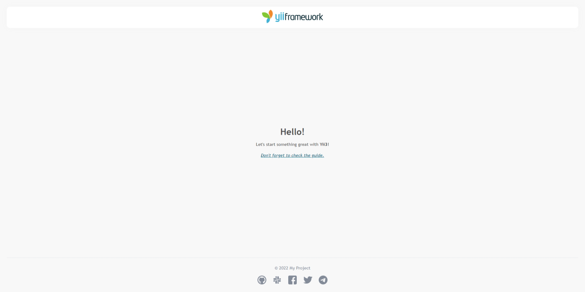

<p align="center">
    <a href="https://github.com/yiisoft" target="_blank">
        
    </a>
    <h1 align="center">Yii application template</h1>
    <h3 align="center">Yii application template for Yii 3 is best for rapidly creating projects.</h3>
    <br>
</p>

[](https://packagist.org/packages/yiisoft/app)
[](https://packagist.org/packages/yiisoft/app)
[](https://github.com/yiisoft/app/actions)
[](https://scrutinizer-ci.com/g/yiisoft/app/?branch=master)
[](https://codecov.io/gh/yiisoft/app)
[](https://github.com/yiisoft/app/actions?query=workflow%3A%22static+analysis%22)
[](https://shepherd.dev/github/yiisoft/app)

<p align="center">
    <a href="https://github.com/yiisoft/app" target="_blank">
        
    </a>
</p>

## Requirements

The minimum requirement by this project template that your Web server supports PHP 8.0.

## Installation

You'll need at least PHP 8.0.

If you do not have [Composer](http://getcomposer.org/), you may install it by following the instructions
at [getcomposer.org](http://getcomposer.org/doc/00-intro.md).

You can then install this project template using the following command:

```
composer create-project --prefer-dist --stability=dev yiisoft/app <your project>
```

In order to launch development web server run:

```
composer run serve
```

Now you should be able to access the application through the URL printed to console.
Usually it is `http://localhost:8080`.

## Directory structure

The application template has the following structure:

```
config/             Configuration files.
docs/               Documentation.
public/             Files publically accessible from the Internet.
    assets/         Published assets.
    index.php       Entry script.
resources/          Application resources.
    assets/         Asset bundle resources.
    layout/         Layout view templates.
    view/           View templates.
runtime/            Files generated during runtime.
src/                Application source code.
    Asset/          Asset bundle definitions.
    Controller/     Web controller classes.
    Command/        Console commands.
tests/              A set of Codeception tests for the application.
vendor/             Installed Composer packages.
```

## Configuration

You can find configuration in `config` directory. There are multiple
configs, and the most interesting is `params.php`. Below there are details about its sections:

### Application Services

There are multiple pre-configured application services. 

#### Aliases

```php
'yiisoft/aliases' => [
    'aliases' => [
        // standard directory aliases
        '@root' => dirname(__DIR__),
        '@assets' => '@root/public/assets',
        '@assetsUrl' => '/assets',
        '@npm' => '@root/node_modules',
        '@public' => '@root/public',
        '@resources' => '@root/resources',
        '@runtime' => '@root/runtime',
        '@views' => '@root/resources/views'
    ],
],
```

See ["Aliases"](https://github.com/yiisoft/docs/blob/master/guide/en/concept/aliases.md) in the guide.

#### Cache

```php
'yiisoft/cache-file' => [
    'file-cache' => [
        // cache directory path
        'path' => '@runtime/cache'
    ],
],
```

#### Log Target File

```php
use Psr\Log\LogLevel;

'yiisoft/log-target-file' => [
    'file-target' => [
        // route directory file log
        'file' => '@runtime/logs/app.log',
        // levels logs target
        'levels' => [
            LogLevel::EMERGENCY,
            LogLevel::ERROR,
            LogLevel::WARNING,
            LogLevel::INFO,
            LogLevel::DEBUG,
        ],
    ],
    'file-rotator' => [
        // maximum file size, in kilo-bytes. Defaults to 10240, meaning 10MB.
        'maxfilesize' => 10,
        // number of files used for rotation. Defaults to 5.
        'maxfiles' => 5,
        // the permission to be set for newly created files.
        'filemode' => null,
        // Whether to rotate files by copy and truncate in contrast to rotation by renaming files.
        'rotatebycopy' => null
    ],
],
```

See ["Logging"](https://github.com/yiisoft/docs/blob/master/guide/en/runtime/logging.md) in the guide.

#### Session

```php
'yiisoft/session' => [
    'session' => [
        // options for cookies
        'options' => ['cookie_secure' => 0],
        // session handler
        'handler' => null
    ],
],
```

#### View

```php
'yiisoft/view' => [
    // Custom parameters that are shared among view templates.
    'defaultParameters' => [
        'applicationParameters' => 'App\ApplicationParameters',
        'assetManager' => 'Yiisoft\Assets\AssetManager',
    ],
    'theme' => [
        // Apply pathMap example: ['@resources/layout' => '@resources/theme'] in yiisoft/app
        // Apply pathMap example: ['@resources/layout' => '@modulealiases/theme'] in module
        'pathMap' => [],
        'basePath' => '',
        'baseUrl' => '',
    ],    
],

```

#### Yii Debug

```php
'yiisoft/yii-debug' => [
    // enabled/disabled debugger
    'enabled' => true
],
```

#### Application Layout Parameters

```php
'app' => [
    'charset' => 'UTF-8',
    'language' => 'en',
    'name' => 'My Project',
],
```

## Testing

The template comes with ready to use [Codeception](https://codeception.com/) configuration.
In order to execute tests run:

```
composer run serve > ./runtime/yii.log 2>&1 &
vendor/bin/codecept run
```

### Static analysis

The code is statically analyzed with [Psalm](https://psalm.dev/). To run static analysis:

```shell
./vendor/bin/psalm
```

### Support the project

[](https://opencollective.com/yiisoft)

### Follow updates

[](https://www.yiiframework.com/)
[](https://twitter.com/yiiframework)
[](https://t.me/yii3en)
[](https://www.facebook.com/groups/yiitalk)
[](https://yiiframework.com/go/slack)

## License

The Yii application template is free software. It is released under the terms of the BSD License.
Please see [`LICENSE`](./LICENSE.md) for more information.

Maintained by [Yii Software](https://www.yiiframework.com/).
