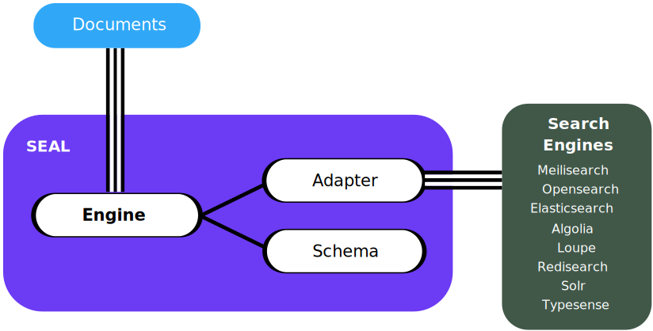

Welcome to SEAL's documentation!
================================

Introduction
------------

**SEAL** stands for: **S** earch **E** ngine **A** bstraction **L** ayer

The SEAL project is a PHP library designed to simplify the process of interacting
with different search engines. It provides a straightforward interface that enables users
to communicate with various search engines, including:

- ``Meilisearch``
- ``Opensearch``
- ``Elasticsearch``
- ``Algolia``
- ``Redisearch``
- ``Solr``
- ``Typesense``

It also provides integration packages for the ``Laravel``, ``Symfony``, ``Spiral``, ``Mezzio`` and ``Yii`` PHP frameworks.

It is worth noting that the project draws inspiration from the
``Doctrine`` and ``Flysystem`` projects. These two projects have been a great inspiration
in the development of SEAL, as they provide excellent examples of how to create consistent
and user-friendly APIs for complex systems.

Structure
---------

SEAL's provides a basic abstraction layer for add, remove and search and filters for documents.
The main class and service handling this is called ``Engine``, which is responsible for all this things.
The ``Schema`` which is required defines the different ``Indexes`` and their ``Fields``.

The project provides different ``Adapters`` which the Engine uses to communicate with the different ``Search Engine`` software and services.
This way it is easy to switch between different search engine software and services.

**Glossary**

.. list-table::
   :widths: 18 82

   * - **Term**
     - **Definition**
   * - ``Engine``
     - The main class and service responsible to provide the basic interface for add, remove and search and filters for documents.
   * - ``Schema``
     - Defines the different ``Indexes`` and their ``Fields``, for every field a specific type need to be defined and what you want todo with them via flags like ``searchable``, ``filterable`` and ``sortable``.
   * - ``Adapter``
     - Provides the communication between the Engine and the Search Engine software and services.
   * - ``Documents``
     - A structure of data that you want to index need to follow the structure of the fields of the index schema.
   * - ``Search Engine``
     - Search Engine software or service where the data will actually be stored currently ``Meilisearch``, ``Opensearch``, ``Elasticsearch``, ``Algolia``, ``Redisearch``, ``Solr`` and ``Typesense`` is supported.

Contents
--------

.. toctree::
    :maxdepth: 1

    getting-started/index
    schema/index
    indexing/index
    search-and-filters/index
    cookbooks/index
    research/index

..
  * :ref:`search`

-----------

Packages
--------

Full list of packages provided by the SEAL project:

- ``schranz-search/seal`` - The core package of the SEAL project.
- ``schranz-search/seal-algolia-adapter`` - Adapter for the Algolia search engine.
- ``schranz-search/seal-elasticsearch-adapter`` - Adapter for the Elasticsearch search engine.
- ``schranz-search/seal-opensearch-adapter`` - Adapter for the Opensearch search engine.
- ``schranz-search/seal-meilisearch-adapter`` - Adapter for the Meilisearch search engine.
- ``schranz-search/seal-redisearch-adapter`` - Adapter for the Redisearch search engine.
- ``schranz-search/seal-solr-adapter`` - Adapter for the Solr search engine.
- ``schranz-search/seal-typesense-adapter`` - Adapter for the Typesense search engine.
- ``schranz-search/seal-read-write-adapter`` - Adapter to split read and write operations.
- ``schranz-search/seal-multi-adapter`` - Adapter to write into multiple search engines.
- ``schranz-search/laravel-package`` - Integrates SEAL into the Laravel framework.
- ``schranz-search/symfony-bundle`` - Integrates SEAL into the Symfony framework.
- ``schranz-search/spiral-bridge`` - Integrates SEAL into the Spiral framework.
- ``schranz-search/mezzio-module`` - Integrates SEAL into the Mezzio framework.
- ``schranz-search/yii-module`` - Integrates SEAL into the Yii framework.

Have also a look at the following tags:

- `https://packagist.org/search/?tags=seal-adapter <https://packagist.org/search/?tags=seal-adapter>`_
- `https://github.com/topics/seal-php-adapter <https://github.com/topics/seal-php-adapter>`_
